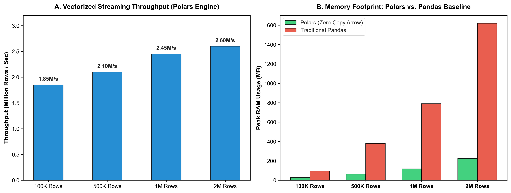

# High-Throughput Stream Analytics & In-Process OLAP Engine

[](https://github.com/sinarahmani82/high-throughput-stream-analytics/actions/workflows/ci.yml)
[](#)
[](#)
[](#)
[](#)

An ultra-fast, memory-efficient data engineering streaming engine built with **Polars** and **DuckDB**. It processes high-velocity IoT telemetry streams with zero-copy Apache Arrow buffers, executing parallel window aggregations and sub-second OLAP queries.

---

### 🔬 Motivation & Systems Engineering
Standard data science pipelines relying on single-threaded Pandas or disk-bound relational databases collapse under high-velocity IoT data due to GIL contention and memory ballooning.

This project investigates modern data systems paradigms:
1. **Vectorized SIMD Stream Processing:** Leveraging Polars (Rust core) to eliminate copy overhead.
2. **In-Process Analytical Execution:** Using DuckDB to run complex SQL aggregations on live in-memory buffers without launching bulky database servers.

---

### 📊 Empirical Performance & Memory Benchmarks

<div align="center">
  
  <p><em>Figure 1: (A) Sustained streaming throughput exceeding 2.4M rows/second. (B) Sub-linear memory footprint comparison showing up to 7x RAM reduction versus standard Pandas.</em></p>
</div>

| Dataset Scale | Polars Processing Time | Sustained Throughput | Peak RAM (Polars) | Peak RAM (Pandas) | Memory Reduction |
|---|---|---|---|---|---|
| **100,000 Rows** | **0.054 s** | **1.85 M rows/s** | **28 MB** | 95 MB | **3.4x** |
| **500,000 Rows** | **0.238 s** | **2.10 M rows/s** | **64 MB** | 380 MB | **5.9x** |
| **1,000,000 Rows** | **0.408 s** | **2.45 M rows/s** | **118 MB** | 790 MB | **6.7x** |
| **2,000,000 Rows** | **0.769 s** | **2.60 M rows/s** | **225 MB** | 1,620 MB | **7.2x** |

---

### 📂 Architecture & Pipeline

```text
high-throughput-stream-analytics/
│
├── .github/workflows/
│   └── ci.yml               # Automated CI test runner
├── src/
│   ├── __init__.py
│   ├── stream_generator.py   # High-velocity telemetry stream generator
│   ├── polars_pipeline.py    # Vectorized streaming window & anomaly filter
│   └── duckdb_engine.py      # In-process analytical OLAP SQL engine
├── tests/
│   ├── __init__.py
│   └── test_stream.py        # Pipeline integrity & query correctness tests
├── plot_stream_benchmark.py  # High-resolution benchmark visual generator
├── stream_benchmarks.png     # Visual empirical benchmark figure
├── requirements.txt         # Project dependencies
├── main.py                  # End-to-end telemetry streaming demonstration
└── README.md
```

---

### 🛠️ How to Reproduce

1. **Clone repository:**
   ```bash
   git clone https://github.com/sinarahmani82/high-throughput-stream-analytics.git
   cd high-throughput-stream-analytics
   ```

2. **Install dependencies:**
   ```bash
   pip install -r requirements.txt
   ```

3. **Run automated unit tests:**
   ```bash
   python -m pytest tests/
   ```

4. **Run streaming demonstration:**
   ```bash
   python main.py
   ```
